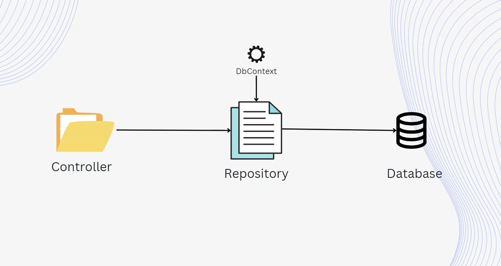


# **Repository Pattern in ASP.NET Core**  

## **1. What is the Repository Pattern?**  
The **Repository Pattern** is a design pattern that separates the **data access layer** from the rest of the application. It provides a **standard interface** for accessing and managing data without exposing database-specific details.  

---



---
## **2. Why Use the Repository Pattern?**  

✅ **Decouples the data access layer** from the business logic.  
✅ **Reduces code duplication** by centralizing data operations.  
✅ **Makes unit testing easier** by allowing data access to be mocked.  
✅ **Supports multiple databases** without changing application logic.  
✅ **Improves maintainability** by using a structured approach.  

---

## **3. How Does It Work?**  

1. **Create an Interface (`IRepository<T>`)**  
   - Defines standard data access methods (CRUD operations).  

2. **Implement the Repository (`Repository<T>`)**  
   - This class contains the actual database operations using **DbContext**.  

3. **Inject the Repository into the Controller**  
   - Instead of injecting `DbContext` directly, the controller uses the repository.  

---

## **4. Repository Pattern Implementation in ASP.NET Core**  

### **Step 1: Create an Interface**
```csharp
public interface IRegionRepository
{
    Task<IEnumerable<Region>> GetAllAsync();
    Task<Region> GetByIdAsync(int id);
    Task AddAsync(Region region);
    Task UpdateAsync(Region region);
    Task DeleteAsync(int id);
}
```

### **Step 2: Implement the Repository**
```csharp
public class RegionRepository : IRegionRepository
{
    private readonly AppDbContext _context;

    public RegionRepository(AppDbContext context)
    {
        _context = context;
    }

    public async Task<IEnumerable<Region>> GetAllAsync()
    {
        return await _context.Regions.ToListAsync();
    }

    public async Task<Region> GetByIdAsync(int id)
    {
        return await _context.Regions.FindAsync(id);
    }

    public async Task AddAsync(Region region)
    {
        await _context.Regions.AddAsync(region);
        await _context.SaveChangesAsync();
    }

    public async Task UpdateAsync(Region region)
    {
        _context.Regions.Update(region);
        await _context.SaveChangesAsync();
    }

    public async Task DeleteAsync(int id)
    {
        var region = await _context.Regions.FindAsync(id);
        if (region != null)
        {
            _context.Regions.Remove(region);
            await _context.SaveChangesAsync();
        }
    }
}
```

### **Step 3: Register the Repository in Dependency Injection**
```csharp
builder.Services.AddScoped<IRegionRepository, RegionRepository>();
```

### **Step 4: Use the Repository in the Controller**
```csharp
[ApiController]
[Route("api/regions")]
public class RegionController : ControllerBase
{
    private readonly IRegionRepository _repository;

    public RegionController(IRegionRepository repository)
    {
        _repository = repository;
    }

    [HttpGet]
    public async Task<IActionResult> GetAllRegions()
    {
        var regions = await _repository.GetAllAsync();
        return Ok(regions);
    }
}
```

---

## **5. Benefits of Using the Repository Pattern**
- ✅ **Separates concerns** (Controllers do not interact with `DbContext` directly).  
- ✅ **Easier to test** (Can mock `IRegionRepository` in unit tests).  
- ✅ **Switching databases is easier** (Can change `RegionRepository` implementation).  
- ✅ **Improves maintainability** by keeping data logic separate from business logic.  

---
                     
## **6. Conclusion**  
The **Repository Pattern** is a **best practice** in ASP.NET Core for managing data access efficiently. It improves code **reusability, testability, and maintainability**, making applications **scalable** and **flexible**.

